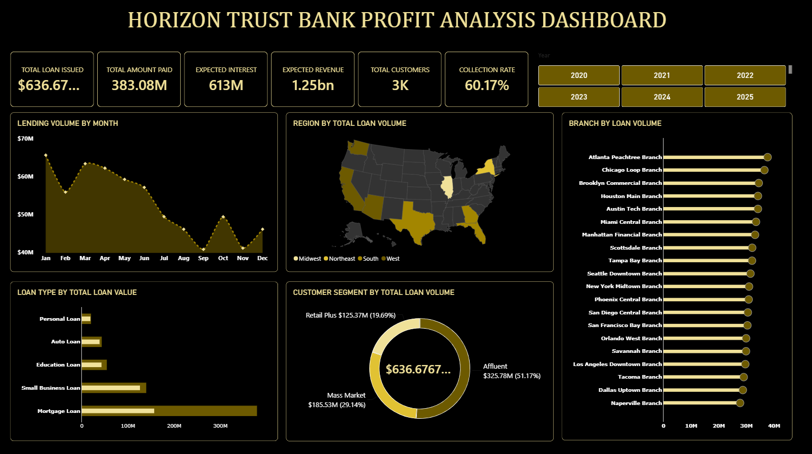
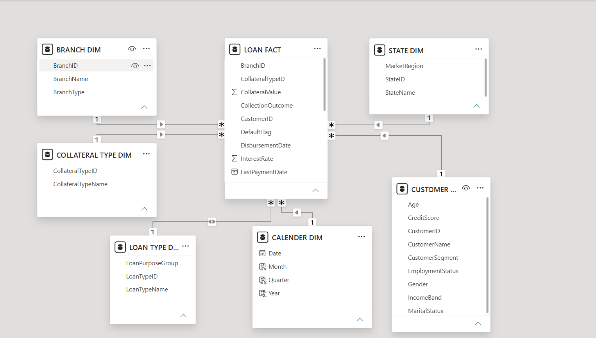
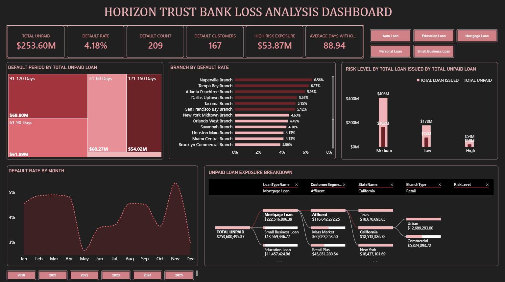

# Horizon Trust Bank: Loan Portfolio Risk Analysis

Power BI credit risk analysis for a mid-sized US commercial bank. 5,000 loans, $636.68M lent, 20 branches, and a management team that could not see where its money or its risk was sitting.

> Portfolio case study using a supplied dataset. Disbursements cover January 2020 to June 2024.



---

## Business Problem

Horizon Trust Bank lends across 8 US states through urban, retail and commercial branches, offering mortgage, small business, education, auto and personal loans.

The book was growing. The data was not built to be analysed. Every loan record, every customer attribute, every branch and geographic detail sat in a single flat table of 37 columns. Nothing could be grouped, compared or drilled into without rebuilding the data each time.

That left management unable to answer basic questions. Which products generate the most value. Which branches underperform. Where defaults concentrate. How long loans sit unpaid. Whether credit risk is spread evenly or clustered in a few places.

The bank asked for a star schema data model and an integrated dashboard split into two views: profit and loss.

---

## Objectives

- Restructure one flat table into a star schema that supports grouping, filtering and time intelligence
- Build KPIs in DAX covering lending volume, repayment, defaults and exposure
- Deliver a Profit view covering growth, product mix, geography, branch performance and customer segments
- Deliver a Loss view covering default rates, loan ageing, risk concentration and the drivers behind defaulted exposure
- Turn the output into decisions management can act on

---

## Dataset

One Excel sheet. 5,000 loan records across 37 columns. No nulls, no duplicate loan IDs.

| Entity | Count |
|---|---|
| Loan records | 5,000 |
| Customers | 2,773 |
| Branches | 20 |
| States | 8 |
| Loan products | 5 |
| Collateral types | 5 |

Each row is one loan. 1,892 customers hold more than one loan, which is why the customer count sits below the record count.

Key fields include `OriginalLoanAmount`, `TotalAmountPaid`, `InterestRate`, `LoanTermMonths`, `DisbursementDate`, `LastPaymentDate`, `RiskLevel`, `DefaultFlag`, `LoanStatus` and `CollectionOutcome`.

---

## Approach

### 1. Assessment before modelling

I checked row counts, null distribution and duplicate loan IDs before touching the structure. I also tested whether each dimension key carried a single consistent set of attributes, because the star schema depends on it. A `CustomerID` mapping to two different credit scores would silently break the model the moment duplicates were removed.

All five keys came back clean across 5,000 rows.

### 2. Star schema

Dimensions were built in Power Query by duplicating the source query, removing every column not belonging to that entity, then removing duplicates on the key.

| Table | Grain | Key |
|---|---|---|
| `LOAN FACT` | One row per loan | `LoanID` |
| `CUSTOMER DIM` | One row per customer | `CustomerID` |
| `BRANCH DIM` | One row per branch | `BranchID` |
| `STATE DIM` | One row per state | `StateID` |
| `LOAN TYPE DIM` | One row per product | `LoanTypeID` |
| `COLLATERAL TYPE DIM` | One row per collateral type | `CollateralTypeID` |
| `CALENDER DIM` | One row per date | `Date` |

The fact table keeps five foreign keys plus the loan's own values and flags. Everything descriptive moved out.



### 3. The date table

Power BI cannot do time intelligence without a continuous date table, so I built one in DAX rather than relying on the disbursement dates already in the fact table.

```dax
CALENDER DIM = CALENDAR(DATE(2020, 1, 1), DATE(2054, 12, 31))

Year = YEAR('CALENDER DIM'[Date])
Month = FORMAT('CALENDER DIM'[Date], "mmmm")
Quarter = "Q" & FORMAT('CALENDER DIM'[Date], "q")
```

The range runs to 2054 because the longest mortgage in the book matures that year. A calendar that stops short of the data produces blanks in every time-based visual.

Month names sort alphabetically by default, which puts April first. I added a month number column and set the month column to sort by it.

### 4. A dedicated measures table

Every measure sits in a separate `MEASURES DIM` table rather than on the fact table. This keeps the model readable and stops measures being mistaken for columns.

### 5. Profit measures

```dax
TOTAL CUSTOMERS = DISTINCTCOUNT('LOAN FACT'[CustomerID])

TOTAL LOAN ISSUED = SUM('LOAN FACT'[OriginalLoanAmount])

TOTAL AMOUNT PAID = SUM('LOAN FACT'[TotalAmountPaid])

COLLECTION RATE = DIVIDE([TOTAL AMOUNT PAID], [TOTAL LOAN ISSUED], 0)
```

`DISTINCTCOUNT` rather than a row count, because 1,892 customers hold more than one loan. Counting rows would have reported 5,000 customers instead of 2,773.

### 6. Loss measures

```dax
TOTAL UNPAID = [TOTAL LOAN ISSUED] - [TOTAL AMOUNT PAID]

DEFAULT COUNT = CALCULATE(COUNT('LOAN FACT'[LoanID]), 'LOAN FACT'[DefaultFlag] = "Yes")

DEFAULT CUSTOMERS = CALCULATE(DISTINCTCOUNT('LOAN FACT'[CustomerID]), 'LOAN FACT'[DefaultFlag] = "Yes")

DEFAULT RATE = DIVIDE([DEFAULT COUNT], COUNT('LOAN FACT'[LoanID]), 0)

HIGH RISK EXPOSURE = CALCULATE(SUM('LOAN FACT'[OriginalLoanAmount]), 'LOAN FACT'[RiskLevel] = "High")

AVERAGE DAYS WITHOUT PAYMENT = AVERAGEX('LOAN FACT', DATEDIFF('LOAN FACT'[LastPaymentDate], TODAY(), DAY))
```

### 7. Loan ageing

The brief asked for default period analysis in 30 day bands. No such field existed, so I built one as a calculated column using nested `IF` statements with `DATEDIFF` against the last payment date, bucketing from under 30 days through to over 360.

```dax
LOAN DEFAULT PERIOD = IF(DATEDIFF('LOAN FACT'[LastPaymentDate], TODAY(), DAY)<= 30, "<30 Days",
 IF(DATEDIFF('LOAN FACT'[LastPaymentDate], TODAY(), DAY)<=60, "31-60 Days",
 IF(DATEDIFF('LOAN FACT'[LastPaymentDate], TODAY(), DAY)<=90, "61-90 Days",
 IF(DATEDIFF('LOAN FACT'[LastPaymentDate], TODAY(), DAY)<=120, "91-120 Days",
 IF(DATEDIFF('LOAN FACT'[LastPaymentDate], TODAY(), DAY)<=150, "121-150 Days",
 IF(DATEDIFF('LOAN FACT'[LastPaymentDate], TODAY(), DAY)<=180, "151-180 Days",
 IF(DATEDIFF('LOAN FACT'[LastPaymentDate], TODAY(), DAY)<=360, "181-360 Days", ">360 Days"
 )))))))
```

### 8. Conditional formatting driven by a measure

Branch default rate bars are coloured by a measure rather than a fixed palette, so branches crossing the 5% threshold flag themselves as the data changes instead of being coloured by hand.

---

## Key Findings

### The book is one product

| Loan type | Total lent | Share |
|---|---|---|
| Mortgage | $379.40M | 59.6% |
| Small Business | $139.63M | 21.9% |
| Education | $54.30M | 8.5% |
| Auto | $43.30M | 6.8% |
| Personal | $20.05M | 3.1% |

Almost 60% of $636.68M sits in one product with an average term of 242 months. Mortgage is where the bank's capital is tied up, and where it stays tied up longest.

### Mortgage returns capital far more slowly than anything else

| Loan type | Lent | Repaid | Repaid as share |
|---|---|---|---|
| Personal | $20.05M | $18.67M | 93.14% |
| Small Business | $139.63M | $126.06M | 90.28% |
| Auto | $43.30M | $38.62M | 89.19% |
| Education | $54.30M | $42.84M | 78.90% |
| Mortgage | $379.40M | $156.89M | 41.35% |

Every product except mortgage has returned between 79% and 93% of what was lent. Mortgage has returned 41%, because its average term is 242 months against 36 to 70 months elsewhere.

Across the whole book, $383.08M of $636.68M has been repaid, a collection rate of 60.17%. That figure reflects where the portfolio sits in its life rather than a recovery problem, and stepping the year slicer proves it: 2020 loans sit at 73.06% repaid, 2024 loans at 40.86%.

### Lending is flat, and seasonal

| Year | Lending |
|---|---|
| 2020 | $146.80M |
| 2021 | $134.35M |
| 2022 | $146.48M |
| 2023 | $133.04M |
| 2024 | $76.00M (January to June) |

The book is not growing. It holds between $133M and $147M across four full years, and the half year of 2024 annualises to the same range.

Within the year there is a clear cycle. January is the strongest month at $65.65M, September the weakest at $40.82M. A 61% gap that repeats across the period, and nothing in current planning reflects it.

### Affluent customers carry half the book

| Segment | Customers | Lent | Share |
|---|---|---|---|
| Affluent | 1,097 | $325.78M | 51.17% |
| Mass Market | 1,117 | $185.53M | 29.14% |
| Retail Plus | 559 | $125.37M | 19.69% |

Affluent and Mass Market hold almost identical customer counts, 1,097 against 1,117, yet Affluent borrows 76% more. Average loan size separates them, not customer volume.

### Defaults sit almost entirely in one segment

| Segment | Defaults | Default rate |
|---|---|---|
| Mass Market | 196 | 9.82% |
| Retail Plus | 10 | 0.97% |
| Affluent | 3 | 0.15% |

Mass Market carries 196 of the bank's 209 defaults, 93.8% of them, on 29% of the lending. Affluent holds half the book and has defaulted three times.

This is the sharpest split in the portfolio. Nothing else comes close to it.



### Product default rates vary four times over

| Loan type | Default rate | Defaults |
|---|---|---|
| Small Business | 7.79% | 76 |
| Personal | 4.97% | 48 |
| Auto | 3.52% | 35 |
| Education | 2.87% | 30 |
| Mortgage | 1.96% | 20 |

Small business lending fails at four times the rate of mortgage lending, on a $139.63M book. It is the second largest product by value and the most likely to go bad.

Small business default rate also swings hard by vintage: 5.86% in 2020, 10.40% in 2021, 9.28% in 2022, 5.03% in 2023, 8.70% in 2024. Mortgage share of lending stays between 56.7% and 60.8% every year. The product mix is stable. The credit quality is not.

### Branch volume is tight, branch risk is not

Lending runs from $37.68M at Atlanta Peachtree down to $27.71M at Naperville. A 1.4 times spread across 20 branches, which is narrow. No branch carries the network and none fails to lend.

Default rate tells a different story.

| Branch | Default rate |
|---|---|
| Naperville | 6.56% |
| Tampa Bay | 6.27% |
| Atlanta Peachtree | 5.95% |
| Dallas Uptown | 5.26% |
| Tacoma | 5.15% |
| San Francisco Bay | 5.12% |
| Manhattan Financial | 2.36% |
| Scottsdale | 2.37% |

A 2.8 times spread, against a 1.4 times spread on volume. The difference is not explained by how much each branch lends, which points at how loans are approved locally.

Two branches make the case. Naperville lends the least in the network and defaults the most. Atlanta Peachtree lends the most and has the third worst default rate.

### Exposure and default sit in different places

| Risk level | Total lent | Outstanding | Default rate |
|---|---|---|---|
| Medium | $405.03M | $161.71M | 0.00% |
| Low | $177.78M | $74.12M | 0.00% |
| High | $53.87M | $17.78M | 33.33% |

All 209 defaults sit in the High band. Low and Medium have none between them.

That tells you something about the field itself. Risk level in this dataset records what happened rather than predicting it. It is a label applied with knowledge of the outcome, not a score, so it cannot be used as an early warning signal.

It also shows where the money is. $161.71M of outstanding balance sits in Medium, which has never produced a default. The largest exposure and the actual losses are in different bands entirely.

### Outstanding balance is driven by size, not risk

The decomposition tree breaks $253.60M of outstanding balance down through product, segment, state and branch type.

| Product | Outstanding |
|---|---|
| Mortgage | $222.52M |
| Small Business | $13.57M |
| Education | $11.46M |

Mortgage leads by a distance. It also has the lowest default rate in the portfolio at 1.96%. Mortgage holds 88% of the outstanding balance and under 10% of the failures.

The tree is ranking loan size and term length. Read as a loss ranking, it points management at the safest product in the book.

### Loan ageing clusters in the middle bands

Ageing is calculated against the current date, so these figures are as at 23 September 2026, the date the dashboard was captured.

| Days since last payment | Outstanding |
|---|---|
| 91-120 Days | $69.80M |
| 61-90 Days | $61.89M |
| 31-60 Days | $60.27M |
| 121-150 Days | $54.02M |
| <30 Days | $7.62M |

Only $7.62M had seen a payment inside the previous month.

### Geography and branch type are weaker drivers

| State | Lending | Default rate |
|---|---|---|
| New York | $98.55M | 3.62% |
| Texas | $97.06M | 3.87% |
| Florida | $95.40M | 4.99% |
| California | $90.49M | 3.85% |
| Georgia | $67.54M | 5.19% |
| Illinois | $64.23M | 4.70% |
| Arizona | $62.91M | 3.05% |
| Washington | $60.49M | 4.33% |

By region, the South leads on lending at $260.00M across 1,985 loans, followed by the West at $213.90M. The Northeast and Midwest together account for barely a quarter of lending.

Default rate by state runs 3.05% to 5.19%, and by branch type Urban sits at 5.10% against Retail at 3.57%. Both spreads are real but neither comes close to the segment or product splits above.

---

## The Ten Questions, Answered

The brief set five questions for profit and five for loss.

| # | Question | Answer |
|---|---|---|
| P1 | How has lending volume grown since the first disbursement? | It has not. Lending holds between $133M and $147M across four full years, with a repeating January peak and September trough. |
| P2 | Which loan types generate the highest loan value and amount paid? | Mortgage on value at $379.40M. Small Business on repayment share at 90.28% against Mortgage at 41.35%. |
| P3 | Which states and market regions drive lending? | New York $98.55M, Texas $97.06M, Florida $95.40M. By region, South $260.00M then West $213.90M. |
| P4 | Which branches are the top performers by volume? | Atlanta Peachtree $37.68M, Chicago Loop $36.52M, Brooklyn Commercial $34.48M. The spread across all 20 is only 1.4 times. |
| P5 | Which customer segments contribute the most? | Affluent at $325.78M, 51.17% of lending, from 1,097 customers. |
| L1 | What does loan ageing look like in 30 day bands? | Balances cluster between 31 and 150 days. As at 23 September 2026, only $7.62M had seen a payment inside 30 days. |
| L2 | Which branches have the highest default rates? | Naperville 6.56%, Tampa Bay 6.27%, Atlanta Peachtree 5.95%. Six branches sit above 5%. |
| L3 | How does unpaid exposure vary across risk levels? | Medium holds $161.71M outstanding with no defaults. High holds $17.78M with all 209. |
| L4 | How has default rate changed over time? | It rises across vintages: 3.43%, 4.37%, 4.66%, 3.81%, 5.06%. Newer loans fail more often despite less time to fail. |
| L5 | What is driving defaulted exposure? | Customer segment first, Mass Market at 93.8% of defaults. Product second, Small Business at four times the mortgage rate. Geography third and much weaker. |

---

## Recommendations

**Start with Mass Market underwriting.** The segment carries 93.8% of all defaults on 29% of lending. No other cut of this portfolio concentrates risk so tightly, and any tightening of credit policy should begin there.

**Review small business approval criteria.** A 7.79% default rate on a $139.63M book, with vintage rates swinging between 5.03% and 10.40%, points to inconsistent standards rather than a product that is inherently riskier.

**Treat branch default rate as a local control problem.** Volume and default rate move independently across 20 branches, so a 2.8 times spread in failure is not explained by lending scale. Naperville, Tampa Bay and Atlanta Peachtree need their credit decisions reviewed.

**Rebuild risk classification from underwriting data.** The current field has no predictive value because it is assigned after the outcome. The bank captures customer and loan attributes at origination and none of them currently feed a forward-looking score.

**Separate outstanding balance from loss in reporting.** Mortgage holds 88% of the outstanding balance and under 10% of the failures. Reporting the two together sends capital and attention to the safest product in the book.

**Plan capacity around the lending cycle.** A 61% swing between January and September is predictable and repeats annually.

---

## Limitations

- **Risk level cannot be used as a predictor.** Low and Medium carry a 0.00% default rate, so the field describes outcomes rather than anticipating them. Any conclusion drawn from it is descriptive.
- **Outstanding balance is not loss.** The $253.60M figure is principal not yet due on a portfolio roughly 60% through its average term.
- **Collateral type adds nothing independent.** Each product maps to exactly one collateral type across all 5,000 rows: Mortgage to Property, Auto to Vehicle, Education to Co-Signer, Small Business to Business Guarantee, Personal to Unsecured. A collateral view would restate the product view.
- **Average days without payment is a point in time figure.** It calculates against the current date, so it moves each day the file is opened.
- **Disbursements stop on 30 June 2024.** The 2024 figures cover six months. They are not a drop in lending.

---

## Tools and Skills

**Data modelling**: star schema design from a single flat table, dimension extraction in Power Query, key integrity validation, relationship configuration and cardinality, diagnosing and repairing an inactive relationship

**DAX**: `SUM`, `DISTINCTCOUNT`, `COUNT`, `CALCULATE`, `DIVIDE`, `AVERAGEX`, `DATEDIFF`, `CALENDAR`, `YEAR`, `FORMAT`, `IF`, nested conditional logic, calculated columns, a dedicated measures table, sort by column

**Power Query**: query duplication, column removal, duplicate removal on key, data type handling

**Visualisation**: two page report with cross-filtering, KPI cards, lollipop bar chart, line chart, donut chart, shape map, horizontal bullet chart, treemap, clustered bar and column charts, decomposition tree, combo chart with a secondary axis, slicers, conditional formatting by field value, data label and axis formatting

**Analysis**: separating exposure from risk, reading concentration across four dimensions, testing whether a classification field carries predictive value, comparing rate against volume to isolate where variation comes from

---

## Files

| File | Description |
|---|---|
| `horizon-trust-dashboard.pbix` | Power BI report, two pages |
| `horizon-trust-dashboard.pdf` | Both dashboard pages, viewable without Power BI |
| `horizon-trust-raw-data.xlsx` | Source dataset, 5,000 loan records |
| `profit-dashboard.png` | Profit analysis page |
| `loss-dashboard.png` | Loss analysis page |
| `data-model.png` | Star schema model view |
